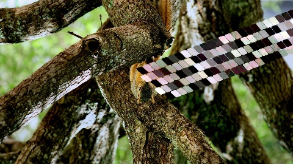
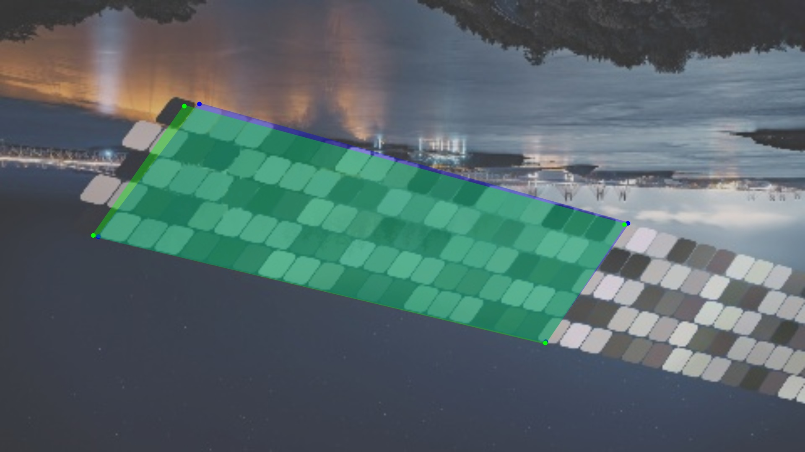
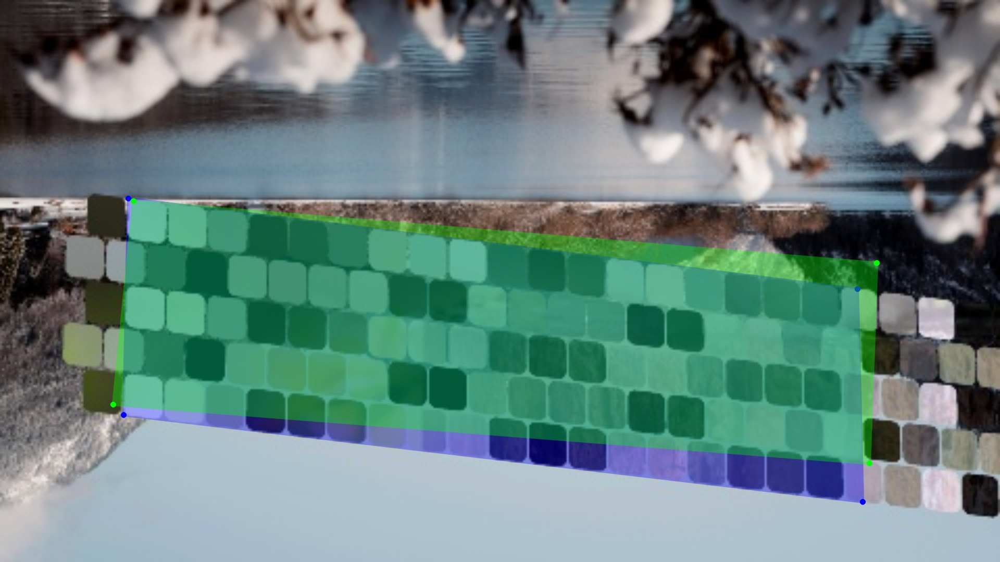
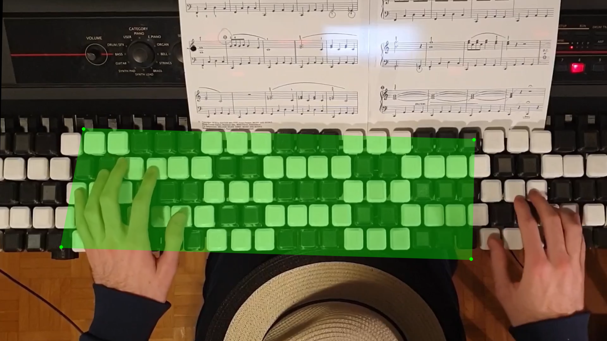

# Jankó Registration

## Goal

Detect the position, size, rotation, and perspective of a **[Jankó piano](https://en.wikipedia.org/wiki/Jank%C3%B3_keyboard) in a photograph** by predicting the four corners of a quadrilateral surrounding either:

- the keys that are fully visible or
- the keys that belong to the first 3 visible octaves.

The piano geometry itself is generated by Manim and serves as the canonical reference for synthetic training data and, eventually, image overlays.

## Approach

The focus is a **neural-network-based approach**.

The model takes an image and predicts four corner points:

```text
top-left
top-right
bottom-right
bottom-left
```

The coordinates are normalized to the range `[0, 1]` during training.

The current network is a small convolutional neural network implemented in PyTorch and trained entirely on synthetic data.

## Synthetic data

Synthetic training images are generated using `generate.py` from the full 88-key Jankó piano visuals defined in `janko_piano_base.py`.

For each image, the generator randomly varies:

* piano scale, position, and rotation
* perspective distortion
* image backgrounds
* brightness and contrast
* blur, noise, and JPEG artifacts
* how much of the piano is cropped by the image boundaries

A synthetic image may look as follows:



Because the transformation is generated programmatically, the exact four target corner points are known automatically.

Synthetic data is stored in:

```text
data/
├── backgrounds/
├── synthetic/  # <- here
│   ├── images/
│   └── labels.jsonl
├── real_pictures/
├── models/
└── visualizations/
```

## Project structure

```text
janko-registration/
├── src/
│   └── janko_registration/
│       ├── geometry/   # Canonical Jankó geometry and geometric utilities
│       ├── neural/     # Dataset, neural network, and training code
│       ├── piano/      # Manim Jankó piano definition
│       ├── render/     # Visualization and future image overlays
│       └── synth/      # Synthetic training-data generation
│
├── data/
│   ├── backgrounds/    # Source background photographs
│   ├── models/         # Trained model checkpoints
│   ├── public/         # Files for use in the README
│   ├── real_pictures/  # Real photographs for evaluation
│   ├── synthetic/      # Generated training data
│   └── visualizations/ # Prediction visualizations
│
├── examples/
├── tests/
├── pyproject.toml
└── README.md
```

`piano/janko_piano_base.py` is the source of truth for the Jankó piano geometry. `geometry/` converts the Manim representation into a numerical representation that can be used by the rest of the project.

## Usage

### Generate synthetic training data

```sh
uv run python -m janko_registration.synth.generate --seed 42 --count 5000
```

### Train the neural network

```sh
uv run python -m janko_registration.neural.train_nn_corners --data_count -1 --epochs 40
```

`--data_count -1` uses all available synthetic samples.

### Visualize predictions

Generate images showing the model's predicted corners against the known corners of synthetic examples and against real photographs:

```sh
uv run python -m janko_registration.render.visualize_examples \
    --model_name NN_v2_260825_1122.pth \
    --train_start_idx 0 \
    --nr_train_examples 3 \
    --test_start_idx 4500 \
    --nr_test_examples 3 \
    --nr_real_examples 3
```

The **blue** bounding box is the ground truth – the **green** bounding box is the model's prediction.

#### Training set visualization example



#### Test set visualization example

(Still needs to be improved)



#### Real visualization example

(Quality varies strongly between images)



## Future direction

The current goal is to establish a reliable neural model for corner-point detection.

Once that works well, the predicted quadrilateral can be used to recover the corresponding geometric transformation and place the canonical Manim Jankó piano animation accurately onto a video, using that video's extracted frames.
